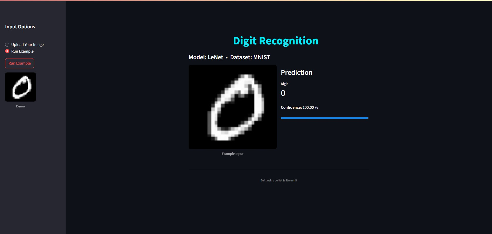

# Digit Recognition with LeNet

A simple web app that uses a trained LeNet-5 model to recognize handwritten digits from the MNIST dataset. Built with PyTorch and Streamlit, you can upload your own digit images or run a built-in example to see real-time predictions.
---

## Features

- **LeNet-5** architecture trained on MNIST  
- **Streamlit** interface for quick demo  
- Upload your own `PNG`/`JPG` digit image  
- View prediction label and confidence score  
- Run a built-in example image with one click  

---
## 📷 UI Preview

## Repository Structure
├── lenet_model.pt      

├── demo_0.jpg          

├── app.py              

├── requirements.txt    

└── README.md          

## LeNet-Style Model Architecture

This project uses a custom LeNet‐style CNN. The network accepts **28×28** grayscale images and produces raw logits over `num_classes` (10 for MNIST). Layer by layer it is:

| Step | Layer Type          | Parameters                                  | Output Shape              |
|:----:|:--------------------|:--------------------------------------------|:--------------------------|
|  1   | **Input**           | —                                           | `(batch, 1, 28, 28)`      |
|  2   | Conv2d              | in=1, out=6, kernel=5×5, padding=“same”     | `(batch, 6, 28, 28)`      |
|  3   | AvgPool2d           | kernel=2×2, stride=2                        | `(batch, 6, 14, 14)`      |
|  4   | ReLU                | —                                           | `(batch, 6, 14, 14)`      |
|  5   | Conv2d              | in=6, out=16, kernel=5×5, padding=0         | `(batch, 16, 10, 10)`     |
|  6   | AvgPool2d           | kernel=2×2, stride=2                        | `(batch, 16, 5, 5)`       |
|  7   | ReLU                | —                                           | `(batch, 16, 5, 5)`       |
|  8   | Flatten             | —                                           | `(batch, 16 × 5 × 5 = 400)`|
|  9   | Linear (FC1)        | in=400, out=120                             | `(batch, 120)`            |
| 10   | Linear (FC2)        | in=120, out=84                              | `(batch, 84)`             |
| 11   | Linear (FC3 / Out)  | in=84, out=`num_classes` (e.g. 10)          | `(batch, num_classes)`    |

- **Convolutions** extract local features with small 5×5 kernels.  
- **Average pooling** halves spatial dimensions, adding translational invariance.  
- **ReLU activations** introduce non‐linearity after each pooling block.  
- **Flatten → Fully‐Connected** layers perform classification based on the 400-dim feature vector.  
- The final layer outputs raw logits; Applying **softmax** at inference time to obtain probabilities.

